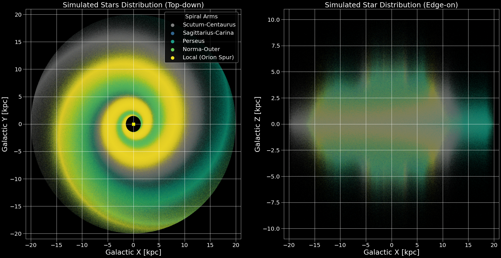

# Summary

[**StarEstate**](https://github.com/AmedeoRom/StarEstate) is a Python package designed to generate synthetic populations of stars for the Milky Way or elliptical galaxies. Creating mock catalogs is essential for interpreting observational data and testing stellar physics theories. StarEstate produces realistic stellar systems by assigning positions, ages, and chemical compositions based on statistical distributions and stellar evolution models.

A key feature is the ability to model detailed sub-structures, including the distinction between thin and thick disks, and the probabilistic assignment of stars to specific spiral arms based on dynamical temperature and age.

# Statement of need

Population synthesis allows the comparison of theoretical formation models with observational data. However, a significant bottleneck in existing workflows is the computational cost of generating large stellar populations. Numerical integration for every star can result in runtime hours.

StarEstate addresses this by implementing a pre-calculated sampler workflow. By storing numerical solutions for integrals in dedicated files, the software reduces the computational time for generating stellar populations in spiral and elliptical galaxies by orders of magnitude.

This efficiency allows for rapid iterations, making StarEstate particularly useful to:

1.  Generate massive statistical samples for Galaxy visualization.
2.  Map synthetic stellar populations from detailed MESA evolutionary simulations [@Paxton_2011; @Paxton_2013; @Paxton_2015; @Paxton_2018; @Paxton_2019; @Jermyn_2023] or rapid single and binary stellar evolution (SSE/BSE) codes based on @Hurley_2000.
3.  Analyze stellar types (e.g., OB-type, Wolf-Rayet, Red Supergiant) across different galactic environments and input stellar physics.

# Methodology

## Stellar Integration and Quantization

A quantization module bins the continuous masses and metallicities drawn from samplers to the closest matching tracks in a user's library. It automatically assigns stellar types following the Morgan-Keenan classification (in combination with @Hurley_2000 evolutionary types for SSE/BSE) and identifies evolutionary phases based on configurable physical conditions.

## Galactic Morphology

StarEstate supports two galaxy shapes: **Elliptical Galaxies** (uniform distribution of radial angles) and **Spiral Galaxies** (stars assigned membership probability to specific Milky Way arms).

A novel feature is the use of "Dynamical Temperature" (velocity dispersion) to determine how tightly populations trace spiral arms based on age [@Mackereth_2019]:

* **Young Tracers ($< 100$ Myr):** Dynamically "cold" populations (e.g., OB stars) tightly confined to spiral arms.
* **Intermediate Tracers ($100$ Myr -- $1$ Gyr):** Dynamically "warmer" populations (e.g., Cepheids) showing a more dispersed concentration.
* **Old Tracers ($> 1$ Gyr):** Dynamically "hot" populations with large velocity dispersions, tracing a smoother, lower-contrast pattern.

The spiral arm parameters (below) combine data from various sources to map the Milky Way's major arms and are all customizable.

\footnotesize
\setlength{\tabcolsep}{3pt}

| Arm Name | Pitch Angle ($p$) [$^\circ$] | Ref. Radius ($R_{\text{ref}}$) [kpc] | Ref. Angle ($\beta_{\text{kink}}$) [$^\circ$] | Radial Range [kpc] | Prob. |
| :--- | :---: | :---: | :---: | :---: | :---: |
| **Scutum-Centaurus** | $2.0^{1}$ | $3.14^{1, 2}$ | $25^{1}$ | $3.0 - 16.0^{1, 3}$ | 0.30 |
| **Sagittarius-Carina** | $13.1^{4}$ | $4.93^{4}$ | $-45^{4}$ | $4.0 - 16.0^{1, 3}$ | 0.25 |
| **Perseus** | $9.5^{5}$ | $9.94^{6}$ | $150^{1}$ | $6.0 - 18.0^{1}$ | 0.20 |
| **Sagittarius-Carina** | $13.0^{4}$ | $4.0^{7}$ | $-100^{1}$ | $3.5 - 20^{1, 6, 8}$ | 0.15 |
| **Local (Orion Spur)** | $10.1^{1}$ | $8.15^{9}$ | $0^{10}$ | $6.0 - 9.0^{11}$ | 0.10 |

\normalsize
\setlength{\tabcolsep}{6pt}

**Table Notes:**
1. @Reid_2019
2. Consistent with models where arms begin near center.
3. Starts near central bar end, extends into disk.
4. @Vallee_2017
5. Average around curvature kink in @Reid_2019.
6. @Bobylev_2013
7. "Kink" radius of 4.46 kpc [@Reid_2019].
8. Combined inner Norma and distant Outer arm.
9. Sun Distance.
10. Galactocentric coordinate system.
11. @Xu_2016

# Acknowledgements
I acknowledge contributions from Tom Wagg and Floor Broekgaarden. I acknowledge financial support from the European Research Council for the ERC Consolidator grant DEMOBLACK, under contract no. 770017 and from the German Excellence Strategy via the Heidelberg Cluster of Excellence (EXC 2181 - 390900948) STRUCTURES.

# References
